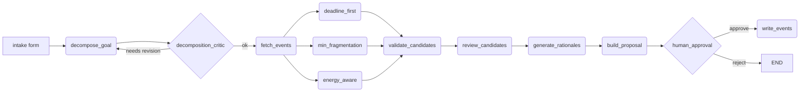

# Calendar Planning Agent

A multi-agent calendar augmentation system that takes a user's
natural-language goal, decomposes it into subtasks via an LLM,
finds free time on Google Calendar, builds three heuristic candidate
schedules, validates them against hard constraints, and writes only
the user-approved schedule back to the calendar.

Add-only by design: the agent never updates or deletes existing
events.

## Highlights

- **Multi-agent planning loop** — decomposition critic + per-candidate
  reviewers refine LLM output before users see it.
- **Three heuristic strategies** — `deadline_first`,
  `min_fragmentation`, and `energy_aware` — surfaced side by side so
  the user picks, not the agent.
- **Pluggable LLM providers** — Anthropic, Gemini, Vertex AI,
  any OpenAI-compatible endpoint, plus a deterministic mock for
  fully offline runs.
- **Three-tier test suite** — programmatic units, pipeline-level
  integration with mocked LLM, and real-LLM integration tests
  that hit Vertex AI.
- **Mock-first** — `CALENDAR_MODE=mock LLM_PROVIDER=mock` runs the
  full UX without any cloud credentials.

## Architecture



| Module | Location | Purpose |
|---|---|---|
| Frontend | `src/frontend/` | Streamlit UI: intake form, FullCalendar review, approval controls |
| Calendar API | `src/calendar_api/` | Google Calendar OAuth, free-slot computation, mock calendar |
| Orchestration | `src/orchestration/` | LangGraph nodes, multi-agent review, three pure heuristics |
| Validator | `src/validator/` | Deterministic OVERLAP / OUT_OF_HOURS / DEADLINE_EXCEEDED checks |
| LLM Client | `src/llm_client/` | Provider-agnostic JSON / text wrapper with retry + truncation handling |

For the deeper contract see `docs/ARCHITECTURE.md`.

## Quick Start

```bash
# 1. Clone and enter the project
cd calendar_planning_agent

# 2. Create a virtual environment
python -m venv .venv && source .venv/bin/activate

# 3. Install dependencies
pip install -r requirements.txt

# 4. Copy env template (no real keys required for mock mode)
cp .env.example .env

# 5. Run fully offline with mock calendar + mock LLM
CALENDAR_MODE=mock LLM_PROVIDER=mock streamlit run src/app.py

# 6. Run the fast no-credentials suite
CALENDAR_MODE=mock LLM_PROVIDER=mock .venv/bin/pytest -q tests/programmatic/
```

## Usage Demo

The repo ships a fixture ICS file with a busy week in May 2026:

```bash
# Show the busy blocks the mock calendar will load
cat demo_busy_blocks_may_2026.ics
```

In mock mode the app reads from `src/calendar_api/mock_calendar.py`
and the demo ICS is a human-readable mirror of those blocks. Submit
a goal such as:

```text
Goal:    Finish the multi-agent paper draft
Deadline: 2026-05-20T17:00
Context: Need 3 deep-work sessions plus 1 review session
```

The agent produces three candidate schedules. Approve one to
"write" the events (mock mode prints the writes; live mode hits
Google Calendar).

### Screenshots

A complete walkthrough captured against the mock calendar with
real Vertex AI for decomposition / rationale generation. Full set
in [docs/screenshots/](docs/screenshots/).

#### 1. Intake form
Goal, deadline, working hours, max session length, configurable
inter-task break, and per-period energy levels.


#### 2. Three candidate schedules side by side

The agent generates three candidates in parallel and lets the user
pick. Existing busy blocks render gray; agent proposals render in
the strategy's color.

| Strategy | Goal | Color |
|----------|------|-------|
| Finish Earliest | Maximise buffer before deadline | blue |
| Keep Time Contiguous | Fill largest slots first to minimise context-switching | green |
| Energy-Aware | Heavy work in high-energy periods | orange |


Each strategy shows: rationale, agent reviews (multi-agent critic
output), task breakdown table, and a FullCalendar week view.

#### 3. Approval confirmation
After the user approves a strategy, the app writes the calendar
events and shows the debug trace.


#### 4. Live Google Calendar after write
End-to-end verification: agent-tagged events appear in the user's
real Google Calendar alongside the existing busy blocks.


## Tests

Three suites, picked deliberately for the rubric:

| Suite | Path | Tests | LLM | Credentials | Wall-clock |
|-------|------|-------|-----|-------------|------------|
| Programmatic unit | `tests/programmatic/` | 118 | Mocked | None | < 1 s |
| Pipeline unit | `tests/pipeline_unit/` | 100 | **Real Vertex AI** (skips when `LLM_PROVIDER=mock`) | Google ADC | ~3–4 min |
| LLM integration | `tests/llm_integration/` | 99 | Real Vertex AI (`-m integration`) | Google ADC | ~110 s |

`tests/pipeline_unit/` calls the real LLM despite the name — its
conftest auto-skips when `LLM_PROVIDER=mock`. Use it only when ADC
credentials are available; otherwise stick to the programmatic suite.

```bash
# Inner CI loop — no credentials, ~1 s
CALENDAR_MODE=mock LLM_PROVIDER=mock .venv/bin/pytest -q tests/programmatic/

# Full real-LLM verification — needs Google ADC
CALENDAR_MODE=mock LLM_PROVIDER=vertex_ai .venv/bin/pytest -q tests/pipeline_unit/
CALENDAR_MODE=mock LLM_PROVIDER=vertex_ai .venv/bin/pytest -v -m integration tests/llm_integration/
```

See `docs/EXPERIMENTAL_SETUP.md` for the exact commands and
`docs/REPRODUCIBILITY.md` for determinism rules.

## Project Report

The full write-up of the project — motivation, multi-agent design,
heuristic comparison, evaluation, and lessons learned — is in
[GenAI_Report_Final.pdf](GenAI_Report_Final.pdf).

## Documentation

- [GenAI_Report_Final.pdf](GenAI_Report_Final.pdf) — full project report.
- [docs/STATUS.md](docs/STATUS.md) — current progress, gaps, and next actions.
- [docs/ARCHITECTURE.md](docs/ARCHITECTURE.md) — graph, state, and module contracts.
- [docs/DEVELOPER_GUIDE.md](docs/DEVELOPER_GUIDE.md) — day-to-day setup, env vars, smoke tests.
- [docs/EXPERIMENTAL_SETUP.md](docs/EXPERIMENTAL_SETUP.md) — how each test tier is run.
- [docs/REPRODUCIBILITY.md](docs/REPRODUCIBILITY.md) — determinism, seeds, version pinning.
- [docs/PERFORMANCE.md](docs/PERFORMANCE.md) — token budgets, retries, complexity notes.
- [docs/TROUBLESHOOTING.md](docs/TROUBLESHOOTING.md) — common failures and fixes.
- [PROGRAMMER_MANUAL.md](PROGRAMMER_MANUAL.md) — long-form reference.

## Production Deployment

`Dockerfile` + `docker-compose.yml` for local containers.
`infrastructure/` contains CloudFormation templates for AWS ECS /
Fargate behind an ALB, with secrets read from AWS Secrets Manager.

## Hard Rules

- Calendar writes are **add-only** — `events().update()` and
  `events().delete()` are never called.
- No secrets are committed (`.env`, `token.json`,
  `credentials.json`, service-account JSON, or API keys).
- Heuristics and validator stay pure: no LLM calls, no API calls,
  no side effects.
- All LLM traffic flows through `src/llm_client/client.py`.
